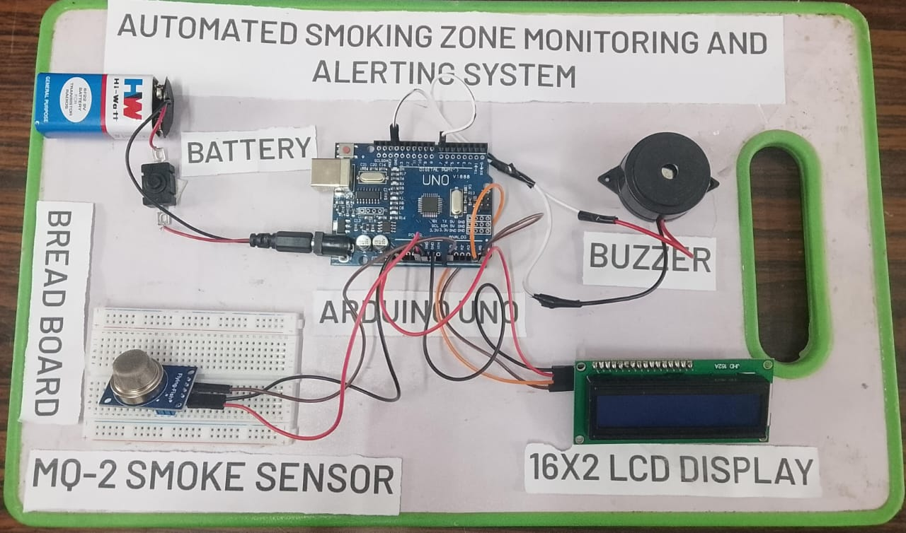

# Automated Smoking Zone Monitoring and Alerting System

An Arduino-based smoke monitoring and alerting system designed to detect smoke in restricted or non-smoking areas and provide real-time visual and audible alerts.

## Project Overview

The system continuously monitors smoke levels using an MQ-2 smoke and gas sensor. An Arduino UNO processes the sensor readings and compares them with a predefined threshold.

When the smoke level exceeds the threshold:
- The buzzer is activated
- The LCD displays a smoke alert
- The smoke level is displayed through the Serial Monitor

The system provides a simple, low-cost and portable solution for monitoring smoke in indoor environments.

## Hardware Used

- Arduino UNO
- MQ-2 Smoke and Gas Sensor
- 16x2 I2C LCD Display
- Buzzer
- 9V Battery / Power Supply
- Breadboard
- Jumper Wires

## Software & Technologies

- Arduino IDE
- C/C++
- Embedded Systems
- Sensor Interfacing
- I2C Communication
- Serial Communication

## Working

1. The MQ-2 sensor continuously monitors the surrounding air for smoke and combustible gases.
2. The Arduino UNO reads the analog output from the MQ-2 sensor.
3. The sensor reading is compared with a predefined threshold value.
4. The current smoke level is displayed on the 16x2 I2C LCD.
5. Under normal conditions, the LCD displays the normal status and the buzzer remains OFF.
6. When the smoke level reaches or exceeds the threshold, the buzzer is activated.
7. The LCD displays a smoke detection alert.
8. Smoke level readings are also displayed through the Serial Monitor.

## Prototype

## Results

- Successfully detected smoke in real time
- Displayed real-time smoke level readings
- Displayed system status on the LCD
- Activated the buzzer when smoke exceeded the threshold
- Provided both visual and audible alerts
- Developed as a portable battery-powered prototype

## Future Scope

The system can be further enhanced with:

- IoT-based remote monitoring
- Wi-Fi or GSM connectivity
- Mobile notifications
- Cloud-based data logging
- Multi-zone smoke monitoring
- Integration with building security systems

## Project Files

- `Smoke_Detection.ino` – Arduino source code
- `Miniproject_Final_Report.pdf` – Complete project report
- `Automated_Smoking_Zone_Prototype.jpeg` – Prototype image
- `README.md` – Project documentation

## Project Type

**5th Semester Mini Project**

Department of Electronics and Telecommunication Engineering  
Sir M. Visvesvaraya Institute of Technology, Bengaluru

## Author

**Jonas Benedict V Jose**  
Electronics and Telecommunication Engineering  
Sir M. Visvesvaraya Institute of Technology, Bengaluru
